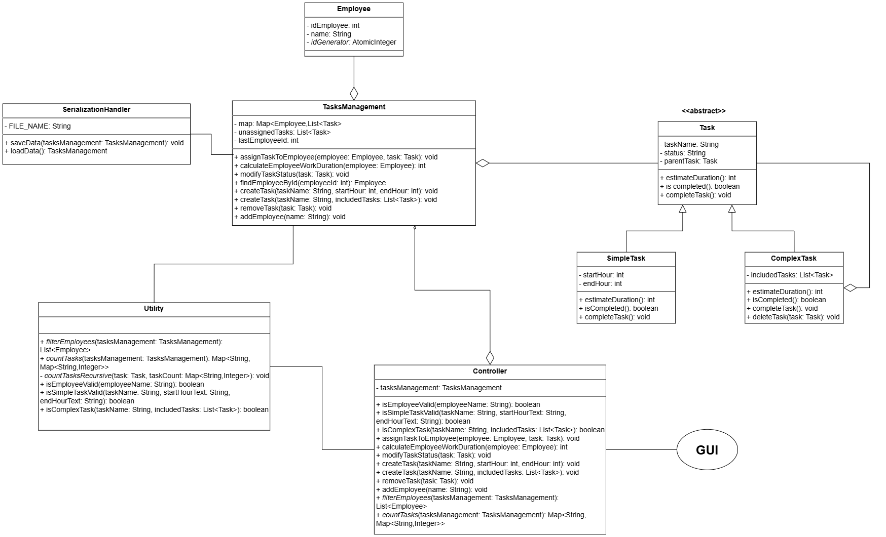
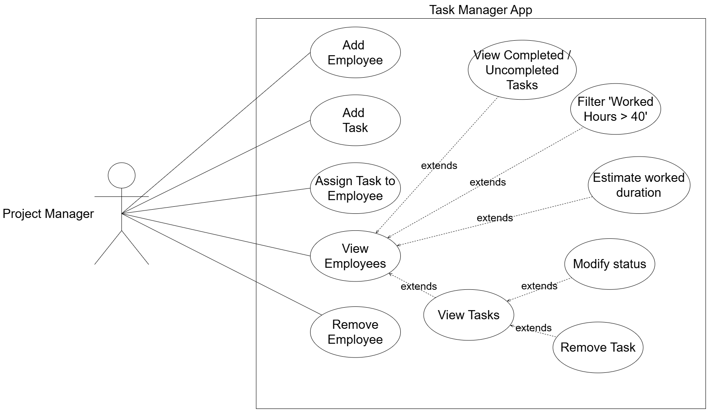
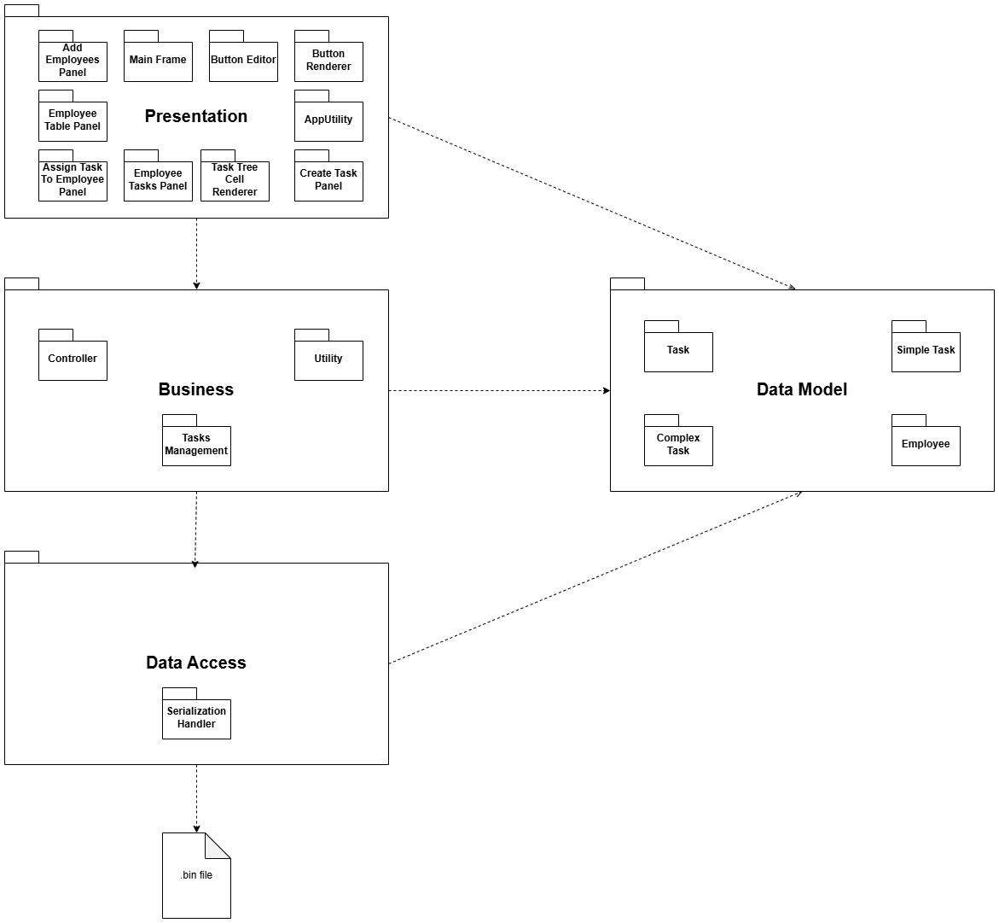

# Task Manager

A desktop task management application built with Java Swing that allows managers to create tasks, manage employees, and track work progress.

## Features

- Create **Simple Tasks** with a start/end hour and description
- Create **Complex Tasks** made up of multiple sub-tasks
- Add and remove employees
- Assign tasks to employees
- Mark simple tasks as completed (complex tasks auto-complete when all sub-tasks are done)
- View each employee's tasks in an interactive tree view
- Track worked hours per employee and filter those exceeding 40 hours
- View completed vs uncompleted task counts per employee
- Data persists between sessions via serialization

## Tech Stack

- **Language:** Java 23
- **GUI:** Java Swing
- **Build Tool:** Maven
- **Persistence:** Java Serialization

## Architecture

Built following a 4-layer architecture:

- `Presentation` — Swing UI panels and frames
- `Business` — Controller and business logic (Utility, TasksManagement)
- `DataAccess` — Data persistence via serialization
- `DataModels` — Core entities: `Task` (sealed), `SimpleTask`, `ComplexTask`, `Employee`

## Getting Started

### Prerequisites

- Java 23+
- Maven

### Run

```bash
git clone https://github.com/YOUR_USERNAME/task-manager.git
cd task-manager
mvn clean install
mvn exec:java
```

## Project Structure

```
src/
└── main/
    └── java/
        └── org/example/
            ├── Business/        # Controller, TasksManagement, Utility
            ├── DataAccess/      # Serialization / persistence
            ├── DataModels/      # Task, SimpleTask, ComplexTask, Employee
            ├── Presentation/    # Swing UI (MainFrame, panels, renderers)
            └── Main/            # Entry point
docs/
    ├── class-diagram.png
    ├── use-case-diagram.png
    └── package-diagram.png
```

## Diagrams

### Class Diagram


### Use Case Diagram


### Package Diagram


## Design Patterns Used

- **Composite Pattern** — `ComplexTask` contains a list of `Task` objects, enabling recursive tree structures
- **MVC Pattern** — `Controller` separates UI from business logic
- **Sealed Classes** — `Task` is a sealed abstract class permitting only `SimpleTask` and `ComplexTask`
